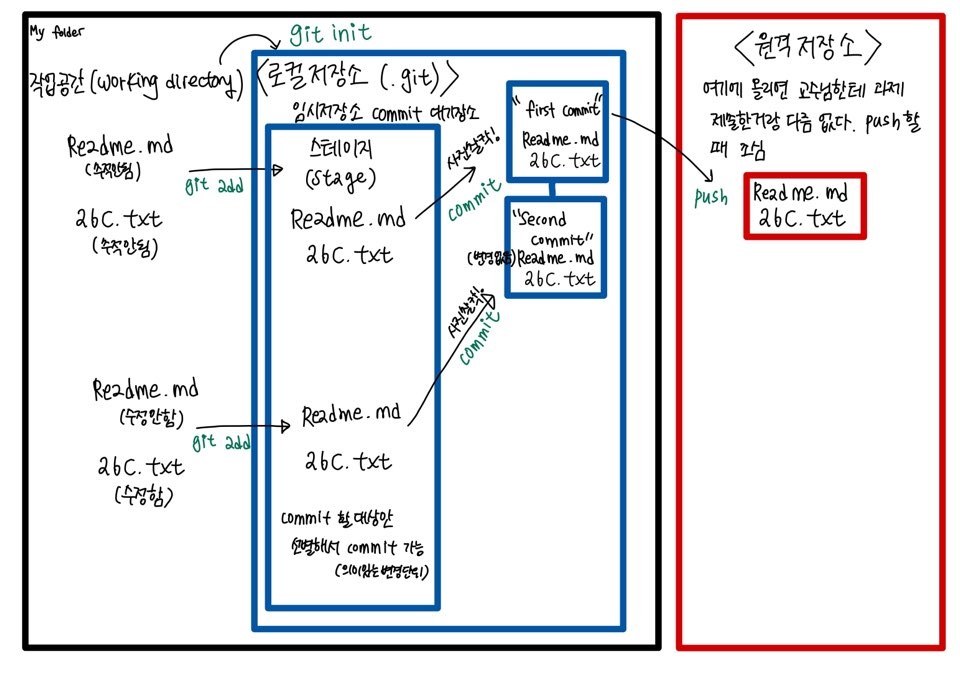

# 1. API

> 다른 시스템 간의 커뮤니케이션 방식, 서비스간의 대화방식

요청을 받는 측에서 일정한 방식을 명세하면  해당 방식으로 정보를 요청하면 준다

특히, 실시간 정보를 받고 싶으면 api를 유용하게 사용하게 된다. 

주로, 요청과 응답으로 주고 받게 된다. 

# 2. GIT

* GIT과 GITHUB
  * 깃과 깃허브는 같지 않으며 내 컴퓨터의 소스코드는 깃, 소스코드를 직접 올리는 공간은 깃허브라고 할 수 있다. 
  * 코드의 역사를 관리하는 도구, 개발과정의 역사 살펴볼 수 있다. 
* 분산버전관리시스템(DVCS)
  * 독립적으로 작업 수행하는 게 가능

* 크게 두곳- 로컬 저장소와 원격 저장소로 나눌수 있다



### 로컬저장소

1.  작업공간(working directory)

   우리가 폴더와 파일을 만드는 공간으로 `git add` 하면 staging area로 넘어가게 된다.

   여기서 수정하거나 하는 내용은 추적이 안된다.


2.  스테이지(stage)

   커밋을 하려고 하는 대상파일들이 있는 공간

   스테이지가 있는 이유는 `commit`할 대상들만 선별하여서 보낼 수 있게 해준다. 

   

3.  커밋(commit)

   사진찍듯이 의미있는 변경단위들을 기록한다. 

   `git push`하면 원격저장소(remote repository)로 올라간다. 

   

### 원격저장소(remote repository)

협업할 때 특히 유용한 공간

원격 저장소에 올라간 내용을 되도록 수정하면 안된다,,,거의 조선왕조 실록 고치는 급,,왜냐하면 collaboration하면 각 일하는 사람이 pull 받아서 일하는 데 충돌이 나기 때문이다.


# 3. 로컬저장소 사용법

* 경로(directory)와 `git status`를 확인하는 것이 중요

### 1) 로컬 저장소 설정

```bash
$ git init
Initialized empty Git repository in C:/Users/최지수/Google 드라이브/TIL/.git/
```

* `git` 폴더가 생성되어야 모든 정보가 기록될 수 있다. 

### 2) git commit author 설정

```bash
$ git config --global user.name __username__
$ git config --global user.email __email__
$ git config --global -l ### author 설정 확인
user.name=edutak
user.email=edutak.ssafy@gmail.com
```

* author 설정을 하지 않으면 `commit` 할 수 없다
* 내 github 계정과 author 설정이 같게 해줘야 github의 잔디밭을 채울수 있다.

### 3) touch

```bash
$ touch abc.txt
```


### 4) add

```bash
$ git add .     # . : 현재 디렉토리(하위 디렉토리 포함)
$ git add a.txt # 특정 파일
$ git add my_folder/ # 특정 폴더
$ git add a.txt b.txt c.txt # 복수의 파일
```

* working area-> staging area


### 5) git status(중요)

```bash
$ git status
On branch master #master branch에 있다

No commits yet #아직 commit 한 내역 없다

Untracked files:##추적되고 있는 내용이 없으니까 add 해서 stage area로 옮겨라
  (use "git add <file>..." to include in what will be committed)
        markdowngrammar.md

nothing added to commit but untracked files present (use "git add" to track)

```

* add 한 후

```bash
$ git add .
$ git status
On branch master

No commits yet
# 커밋이 될 변경사항
# SA 두번째통에 있는 애들..
Changes to be committed:
  (use "git rm --cached <file>..." to unstage)
        new file:   a.txt
```

### 6) commit

```bash
$ git commit -m'review'
[master (root-commit) efcc7bf] review
 1 file changed, 14 insertions(+)
 create mode 100644 markdowngrammar.md
```

* `commit`은 마치 사진찍는 것과 같다
* commit message는 대문자, 용어 사용 일관성 있게 가져간다. 그리고 commit 내역을 명확하게 드러낼 수 있도록 한다.
* `git log`를 통해 git 내역을 확인할 수 있다.  

### 7) git log

```bash
$ git log
commit efcc7bf8af091755f8cb04b38343923e86ae0a42 (HEAD -> master)
Author: jschoi96 <jschoi96@ewhain.net>
Date:   Wed Dec 30 21:29:23 2020 +0900
$ git log --oneline ##최신 commit 한개
4a87519 (HEAD -> master) text written
efcc7bf review
$ git log -2 ##최신 commit 2개
commit 4a875196cae99f39c02c10095a14fa0a4bedc1e6 (HEAD -> master)
Author: jschoi96 <jschoi96@ewhain.net>
Date:   Wed Dec 30 21:42:35 2020 +0900

    text written

commit efcc7bf8af091755f8cb04b38343923e86ae0a42
Author: jschoi96 <jschoi96@ewhain.net>
Date:   Wed Dec 30 21:29:23 2020 +0900

    review
$ git log --oneline -1
4a87519 (HEAD -> master) text written

```

# 4. 원격저장소 활용법
> 다양한 원격저장소 서비스가 있다. 온라인 git hub에 저장소를 미리 만들어줘야 한다.

### 1) 원격저장소 설정

```bash
$ git remote add origin __url___
```

* 원격 저장소(remote)를 origin이라는 이름으로 추가(add) 해줘

* 설정된 원격저장소 확인 방법

  ```bash
  $ git remote -v
  origin  https://github.com/edutak/practice.git (fetch)
  origin  https://github.com/edutak/practice.git (push)
  최지수@DESKTOP-8TGT7U9 MINGW64 ~/Google 드라이브/TIL (master)
$ git remote add origin https://github.com/jschoi96/TIL.git
  error: remote origin already exists.
  
  최지수@DESKTOP-8TGT7U9 MINGW64 ~/Google 드라이브/TIL (master)
  $ git push origin master
  Enumerating objects: 10, done.
  Counting objects: 100% (10/10), done.
  Delta compression using up to 8 threads
  Compressing objects: 100% (10/10), done.
  Writing objects: 100% (10/10), 1.40 MiB | 976.00 KiB/s, done.
  Total 10 (delta 0), reused 0 (delta 0), pack-reused 0
  To https://github.com/jschoi96/TIL.git
   * [new branch]      master -> master
  ```
  
  

### 2) push

```bash
$ git push origin master
```

* branch랑 경로를 잘 확인해 줘야 한다.  main branch 일때도 있음
* push 할 파일이 있는 위치를 잘 확인해야 한다. 