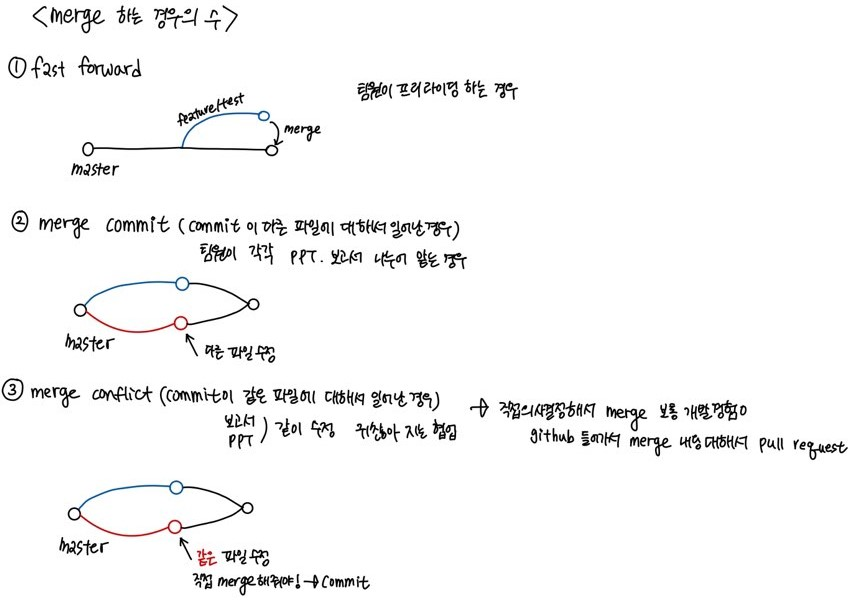

# 1. API

> 다른 시스템 간의 커뮤니케이션 방식, 서비스간의 대화방식

요청을 받는 측에서 일정한 방식을 명세하면  해당 방식으로 정보를 요청하면 준다

특히, 실시간 정보를 받고 싶으면 api를 유용하게 사용하게 된다. 

주로, 요청과 응답으로 주고 받게 된다. 

# 2. git

* git과 github
  * 깃과 깃허브는 같지 않으며 내 컴퓨터의 소스코드는 깃, 소스코드를 직접 올리는 공간은 깃허브라고 할 수 있다. 
  * 코드의 역사를 관리하는 도구, 개발과정의 역사 살펴볼 수 있다. 
* 분산버전관리시스템(DVCS)
  * 독립적으로 작업 수행하는 게 가능
* 크게 두곳- 로컬 저장소와 원격 저장소로 나눌수 있다


### 로컬저장소

1.  작업공간(working directory)

   우리가 폴더와 파일을 만드는 공간으로 `git add` 하면 staging area로 넘어가게 된다.

   여기서 수정하거나 하는 내용은 추적이 안된다.


2.  스테이지(stage)

   커밋을 하려고 하는 대상파일들이 있는 공간

   스테이지가 있는 이유는 `commit`할 대상들만 선별하여서 보낼 수 있게 해준다. 

   

3.  커밋(commit)

   사진찍듯이 의미있는 변경단위들을 기록한다. 

   `git push`하면 원격저장소(remote repository)로 올라간다. 

   

### 원격저장소

협업할 때 특히 유용한 공간

원격 저장소에 올라간 내용을 되도록 수정하면 안된다,,,거의 조선왕조 실록 고치는 급,,왜냐하면 collaboration하면 각 일하는 사람이 pull 받아서 일하는 데 충돌이 나기 때문이다.


# 3. 로컬저장소 사용법

* 경로(directory)와 `git status`를 확인하는 것이 중요

### 1) 로컬 저장소 설정

```bash
$ git init
Initialized empty Git repository in C:/Users/최지수/Google 드라이브/TIL/.git/
```

* `git` 폴더가 생성되어야 모든 정보가 기록될 수 있다. 

### 2) git commit author 설정

```bash
$ git config --global user.name __username__
$ git config --global user.email __email__
$ git config --global -l ### author 설정 확인
user.name=edutak
user.email=edutak.ssafy@gmail.com
```

* author 설정을 하지 않으면 `commit` 할 수 없다
* 내 github 계정과 author 설정이 같게 해줘야 github의 잔디밭을 채울수 있다.

### 3) touch

```bash
$ touch abc.txt
```


### 4) add

```bash
$ git add .     # . : 현재 디렉토리(하위 디렉토리 포함)
$ git add a.txt # 특정 파일
$ git add my_folder/ # 특정 폴더
$ git add a.txt b.txt c.txt # 복수의 파일
```

* working area-> staging area


### 5) git status(중요)

> 로컬저장소 안에서 working directory, staging area 부분의 내역을 보여준다. 

```bash
$ git status
On branch master #master branch에 있다

No commits yet #아직 commit 한 내역 없다

Untracked files:##추적되고 있는 내용이 없으니까 add 해서 stage area로 옮겨라
  (use "git add <file>..." to include in what will be committed)
        markdowngrammar.md

nothing added to commit but untracked files present (use "git add" to track)

```

* add 한 후

```bash
$ git add .
$ git status
On branch master

No commits yet
# 커밋이 될 변경사항
# SA 두번째통에 있는 애들..
Changes to be committed:
  (use "git rm --cached <file>..." to unstage)
        new file:   a.txt
```

* git status 단어

  ```bash
  $ git status
  On branch master
  # 커밋될 변경사항들..
  # staging area에 들어있음
  Changes to be committed:
    (use "git restore --staged <file>..." to unstage)
    # a.txt 삭제된...
          deleted:    a.txt
  
  # 변경사항인데 Staging area 아닌것
  # working directory에 있음
  Changes not staged for commit:
    (use "git add <file>..." to update what will be committed)
    (use "git restore <file>..." to discard changes in working directory)
    # b.txt가 수정된...
          modified:   b.txt
  # working directory에 있음 그러나 git으로 관리 한적 없음
  Untracked files:
    (use "git add <file>..." to include in what will be committed)
    # 새로운 파일..
          c.txt
  ```

  * `untracked`
    * 한번도 git으로 관리한 적 X
    * 파일생성 등
  * `tracked` 
    * `modified`
      * `modified` : 수정
      * `deleted` : 삭제
    * `unmodified` : git status에 등장하지 않음

### 6)git log

> working directory안에서 commit 한 내역들을 보여준다.

```bash
$ git log
commit efcc7bf8af091755f8cb04b38343923e86ae0a42 (HEAD -> master)
Author: jschoi96 <jschoi96@ewhain.net>
Date:   Wed Dec 30 21:29:23 2020 +0900
$ git log --oneline ##최신 commit 한개
4a87519 (HEAD -> master) text written
efcc7bf review
$ git log -2 ##최신 commit 2개
commit 4a875196cae99f39c02c10095a14fa0a4bedc1e6 (HEAD -> master)
Author: jschoi96 <jschoi96@ewhain.net>
Date:   Wed Dec 30 21:42:35 2020 +0900

    text written

commit efcc7bf8af091755f8cb04b38343923e86ae0a42
Author: jschoi96 <jschoi96@ewhain.net>
Date:   Wed Dec 30 21:29:23 2020 +0900

    review
$ git log --oneline -1
4a87519 (HEAD -> master) text written
```


### 7) commit

```bash
$ git commit -m'review'
[master (root-commit) efcc7bf] review
 1 file changed, 14 insertions(+)
 create mode 100644 markdowngrammar.md
```

* `commit`은 마치 사진찍는 것과 같다
* commit message는 대문자, 용어 사용 일관성 있게 가져간다. 그리고 commit 내역을 명확하게 드러낼 수 있도록 한다.
* `git log`를 통해 git 내역을 확인할 수 있다.  

### 8) gitignore 😅

>  git 저장소 내에서 git으로 관리하고 싶지 않은 파일이 있다면,  .gitignore 파일을 만들어서 관리한다.  

```bash
#특정파일
data.csv

#특정폴더
images/

#특정확장자
.png
!data.slsx #요 파일만 빼고 엑셀파일은 다 ignore 해줘

vs.gitignore

```

* confidential한 파일-> 내가 어떤 파일을 관리하지 않을 것이다

* 프로젝트 시작하면서 만들어야 한다. commit 하면 보인다.

* 캐쉬파일?같이 원하지 않는 부수적인 파일 만들어지면 사용한다. 

*   일반적으로, 개발환경/운영체제/측정 언어 등에서 임시 파일과 같이 개발 소스코드와 관련없는 파일은 git 으로 관리하지 않는다. 

* https://github.com/github/gitignore


### 9) undoing

* restore

  ```bash
  ##add 취소
  
  $ git restore --staged abc.txt
  
  $ git status
  On branch master
  Untracked files:
    (use "git add <file>..." to include in what will be committed)
          abc.txt
  
  nothing added to commit but untracked files present (use "git add" to track)
  
  ##working directory 작업내용 취소: commit 되지 않은 변경사항 없애는 것 실행이후 되돌릴 수 없음
  ## commit한 이력 있는 파일 수정하고 나서 작업내용 취소할때
  $ git status
  On branch master
  Changes not staged for commit: 
    (use "git add <file>..." to update what will be committed)
    (use "git restore <file>..." to discard changes in working directory)
          modified:   newbee.txt
  
  no changes added to commit (use "git add" and/or "git commit -a")
  
  $ git restore newbee.txt
  
  ```


* amend

  ```bash
  #commit message 변경
  $ git log --oneline
  5f5ac68 (HEAD -> master) Add d.txt
  d81c176 작업끝
  57ad4ef Status
  fb4ad8d Add b.txt
  ec0574d Add a.txt
  $ git commit --amend
  # vim 편집기로 수정하고 저장 (esc, :wq)
  $ git log --oneline
  # 커밋 해시값 변화!
  0c330b4 (HEAD -> master) Add f.txt
  d81c176 작업끝
  57ad4ef Status
  fb4ad8d Add b.txt
  ec0574d Add a.txt
  ```

  원격저장소에 push한 경우에는 바꾸지 말자!!!!역사바꾸는 일!!!!!!!

* reset
  * `--hard` : 모든 작업(변경사항) 내용과 이력을 삭제 (조심!!!)
  * `--mixed` : 모든 변경사항을 SA에 보관
  * `--soft` : WD 있는 내용까지도 보관

```bash
$ git log --oneline
7c0e191 (HEAD -> master) dd
cb27952 hungry
f60042f merge conflict
92b468c update readme
0347e83 updata readme
439f752 add readme

$ git reset --hard c92b468c #hard 뒤에 붙는 거는 거기로 head 욺기니까 나머지 다 지워라 의미
HEAD is now at cb27952 hungry

$ git log --oneline
92b468c (HEAD -> master) update readme
439f752 add readme
```


* revert

reset과 차이점은 undo 하는 행위자체도 commit으로  history 남음

```bash
$ git log --oneline
0c330b4 (HEAD -> master) Add f.txt
d81c176 작업끝
57ad4ef Status
fb4ad8d Add b.txt
ec0574d Add a.txt

$ git revert 0c330b4
Removing f.txt
[master 56ff1b7] Revert "Add f.txt"
 1 file changed, 0 insertions(+), 0 deletions(-)
 delete mode 100644 f.txt

$ git log --oneline
56ff1b7 (HEAD -> master) Revert "Add f.txt"
0c330b4 Add f.txt
d81c176 작업끝
57ad4ef Status
fb4ad8d Add b.txt
ec0574d Add a.txt
```


# 4. 원격저장소 활용법

> 다양한 원격저장소 서비스가 있다. 온라인 git hub에 저장소를 미리 만들어줘야 한다.

### 1) 원격저장소 설정

```bash
$ git remote add origin __url___
```

* 원격 저장소(remote)를 origin이라는 이름으로 추가(add) 해줘

* 설정된 원격저장소 확인 방법

  ```bash
  $ git remote -v
  origin  https://github.com/edutak/practice.git (fetch)
  origin  https://github.com/edutak/practice.git (push)
  ```

  

### 2) push

```bash
$ git push origin master
$ git push origin master
Enumerating objects: 10, done.
Counting objects: 100% (10/10), done.
Delta compression using up to 8 threads
Compressing objects: 100% (10/10), done.
Writing objects: 100% (10/10), 1.40 MiB | 976.00 KiB/s, done.
Total 10 (delta 0), reused 0 (delta 0), pack-reused 0
To https://github.com/jschoi96/TIL.git
 * [new branch]      master -> master
```

* branch랑 경로를 잘 확인해 줘야 한다.  main branch 일때도 있음

* push 할 파일이 있는 위치를 잘 확인해야 한다. 

* push 충돌 상황

  * git hub에서 하는 모든 활동들은 commit 발생시킴, commit 내용, 버전이 다르면 에러메시지......로컬환경과 깃에있는 데이터 파일이 다르면 안된다

  * 로컬 저장소의 `git log`와 원격저장소의 commit 내역을 비교해 본다. 

  * 충돌날 경우 -pull한 후에 push 한다 or branch를 merge 한다.  

    ```bash
    $ git push origin master
    To https://github.com/edutak/practice.git
     ! [rejected]        master -> master (fetch first)
     # error!!!!!
    error: failed to push some refs to 'https://github.com/edutak/practice.git'
    # 거절(rejected), 왜냐하면..
    # 원격저장소가 가지고 있는 작업사항
    hint: Updates were rejected because the remote contains work that you do
    # 너가 로컬에 가지고 있지 않다.
    hint: not have locally. This is usually caused by another repository pushing
    # 너는 원할거다..
    # 먼저 원격저장소의 변경사항을 통합하는 것을..
    # 다시 push하기 전에
    # git pull .....?
    hint: to the same ref. You may want to first integrate the remote changes
    hint: (e.g., 'git pull ...') before pushing again.
    hint: See the 'Note about fast-forwards' in 'git push --hlp' for details.
    ```


### 3) pull

```bash
#1. pull
#원격 저장소의 변경사항을 받아오고
$ git pull origin master
remote: Enumerating objects: 7, done.
remote: Counting objects: 100% (7/7), done.
remote: Compressing objects: 100% (4/4), done.
remote: Total 6 (delta 2), reused 0 (delta 0), pack-reused 0
Unpacking objects: 100% (6/6), 1.33 KiB | 43.00 KiB/s, done.
From https://github.com/edutak/practice
 * branch            master     -> FETCH_HEAD
   1ce8a44..7822758  master     -> origin/master
Merge made by the 'recursive' strategy.
 README.md | 4 ++++
 1 file changed, 4 insertions(+)
 create mode 100644 README.md

#2. 다시 push
$ git push origin master
Enumerating objects: 6, done.
Counting objects: 100% (6/6), done.
Delta compression using up to 8 threads
Compressing objects: 100% (4/4), done.
Writing objects: 100% (4/4), 499 bytes | 499.00 KiB/s, done.
Total 4 (delta 2), reused 0 (delta 0), pack-reused 0
remote: Resolving deltas: 100% (2/2), completed with 1 local object.
To https://github.com/edutak/practice.git
   7822758..3bb716a  master -> master
```


### 4) git clone

```bash
$ git clone url
```

* git clone과 push의 차이점은 `.git`의 차이다. 

* git clone 폴더에는 `.git`폴더 이미 있기 때문에 `git init ` 하면 안된다.


# 5. collaboration

### 1) branch

* 코드를 통째로 복사하고 원래 코드와는 상관없이 독립적인 개발을 진행 할 수 있도록 해준다. 

* master branch(최종 프로그램 결과물만 올리는 곳) origin(원격저장소), head(가리키고 있는 곳이 내가 있는 위치)

* 기능별로 최대한 branch를 세분화해서 나눠주고 맨 마지막에 master branch로 merge 해준다
* 


   ```bash
   $ git branch __브랜치이름__
   ```


* 브랜치 이동

   ```bash
   $ git checkout __브랜치이름__
   ```

   

* 브랜치 생성 및 이동

   ```bash
   $ git checkout -b __브랜치이름__
   ```

   브랜치 이름을 생성하거나 브랜치 이름으로 이동시켜준다.

   

* 브랜치 목록

   ```bash
   $ git branch
   ```

   

* 브랜치 병합

   ```bash
   (master) $ git merge __브랜치이름__
   ```
   master 브랜치에 브랜치이름을 병합시킨다.

   

* 브랜치 삭제

   ```bash
   $ git branch -d __브랜치이름__
   ```
   
   가지지우는 거는 branch이름만 지운다고 생각해라

### 2) merge

> 일반적으로 branch로 작업한 후 합치기 위해서는 merge 사용

* 특히, 서로 다른 commit에서 같은 파일을 수정한 경우에는 꼭 직접 merge 해줘야 한다. 

* conflict는 오류가 발생한 것이 아니라 이력이 발생하는 과정에서 반드시 발생하는 것이다. 

  

* 두번째 경우, merge 할 때 vim 편집기 화면이 나타난다. 자동으로 작성된 커밋 메시지를 확인하고, `esc`를 누른 후 `:wq`를 입력하여 저장 및 종료한다.`w` : write`q` : quit

  ```bash
  $ git log --oneline --graph #git log 내역을 그림으로 보여준다. 
  *   b318d89 (HEAD -> master) Merge branch 'feature/test'
  |\
  | * 1c3d7ec (feature/test) complete data
  * | 36d058f hotfix
  |/
  * 7b09cf3 add readme
  ```

* 세번째 경우, 충동이 생긴다. `git status`를 통해서 어디에서 충돌이 난건지 확인해준다. 

  ```bash
  $ git merge feature/web
  Auto-merging readme.md
  CONFLICT (content): Merge conflict in readme.md
  Automatic merge failed; fix conflicts and then commit the result.
  
  $ git status
  On branch master
  You have unmerged paths.
    (fix conflicts and run "git commit")
    (use "git merge --abort" to abort the merge)
  
  Unmerged paths:#요기서 merge가 안됨
    (use "git add <file>..." to mark resolution)
          both modified:   readme.md
  
  no changes added to commit (use "git add" and/or "git commit -a")
  
  ##해당 파일열어서 확인해보면 아래처럼 나온다
  <<<<<<< HEAD
  오오 신기하다 이렇게 버전 관리가 되는구나
  =======
  오늘도 난 공부를 열심히 한다
  >>>>>>> feature/web
  
  ##실제로 merge 하려면 vscode 열어서 merge changes 하고, add와 commit 해준다.
  ```

  

  


# 6. etc

* GIT저장소 안에서 GIT 저장소를 쓰지 말것(master 이미 있는데 git init 하지 말아라)

  -기존의 Git 저장소로 쓰고 있던 폴더로 옮김

  \- Git 저장소 쓰고 있는 곳에서 clone이나 init! 

* Github에서 잔디밭이 안되거나 커밋이 내 프로필로 안되는 경우 

  -로컬 환경의 config 문제

 * commit 메시지 작성할 때 통일성 있게 작성해라(대문자, 용어 통일)

   
